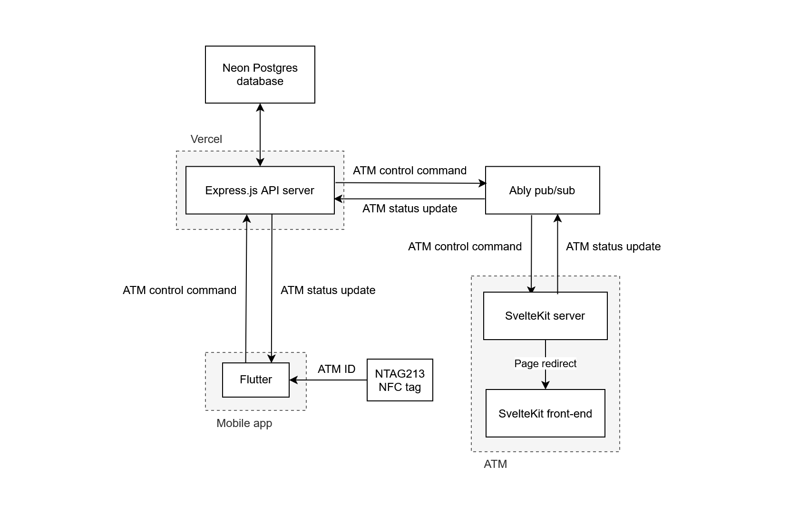

# System architecture: Bombastic Banking

This document explains the architecture of Bombastic Banking, an accessible digital banking prototype. The system comprises three main parts: a mobile app, an ATM server, and an API server.

The system's main feature is "touchless ATM transactions", which allows users to operate ATMs from their mobile phones. Each ATM has their own NTAG213 NFC tag containing the ATM's ID. We plan to move to NTAG424 DNA for proper security, and to integrate an agentic voice assistant in the near future.

For this prototype, we have no cash-related hardware, so all cash transactions are simulated.

- [1. Touchless ATM overview](#1-touchless-atm-overview)
- [2. Definitions](#2-definitions)
- [3. Tech stack](#3-tech-stack)
- [4. System components](#4-system-components)
  - [4.1. Mobile app](#41-mobile-app)
  - [4.2. ATM server](#42-atm-server)
  - [4.3. API server](#43-api-server)
- [5. Realtime messaging](#5-pubsub-messaging)

## 1. Touchless ATM overview

## 2. Definitions

- **Touchless ATM session:** The period during which an authenticated mobile app user is controlling a specific ATM.
- **Touchless ATM transaction:** An ATM deposit / withdrawal made from the mobile app.
- **ATM control command:** A message instructing the ATM to perform a certain action.
- **ATM status update:** A message notifying the API server / mobile app of an ATM's updated status.

## 3. Tech stack

- **Mobile app:** Flutter.
- **ATM server:** SvelteKit.
- **API server:** Express on Vercel.
- **Database:** Neon Postgres.
- **Realtime messaging:** Ably.

## 4. System components

### 4.1. Mobile app

The mobile app is the interface for user account management and touchless ATM transactions.

When it reads the ATM's NTAG213 tag, it uses the API server's HTTP API to start a touchless ATM session using the ATM's ID. During a touchless ATM session, the mobile app sends ATM control commands (e.g. "withdraw $50", "initiate deposit") through the API server's HTTP API.

### 4.2. ATM server

The ATM runs a webapp server hosting its GUI. On start-up, it connects to the pub/sub system, authenticating with the `ATM_KEY` environment variable. The ATM GUI starts in its idle state, and it transitions according to commands from the pub/sub system (refer to [Realtime messaging](#realtime-messaging) below for details).

### 4.3. API server

The API server interfaces with the database and provides HTTP APIs to the mobile app for user account management and ATM command-sending.

The API server acts as an intermediary between the mobile app and the ATM server, relaying via the pub/sub system:

- ATM control commands from the mobile app to the ATM server.
- ATM status updates from the ATM server to the mobile app.

Refer to [Realtime messaging](#realtime-messaging) below for details.

## 5. Realtime messaging

The ATM server and API server perform realtime messaging through a pub/sub system, where each ATM uses a channel named `atm:{atmId}`. The table below documents the events sent through each channel.

| Event                | Originator | Payload         | Description                                                  |
| -------------------- | ---------- | --------------- | ------------------------------------------------------------ |
| `indicate-touchless` | API server |                 | Command the ATM to indicate that a touchless session is in progress, preventing direct ATM interaction. |
| `withdraw`           | API server | Withdraw amount | Command the ATM to dispense the indicated cash amount.       |
| `withdraw-ready`     | ATM        |                 | Notify the API server that the ATM has successfully dispensed cash. |
| `initiate-deposit`   | API server |                 | Command the ATM to prepare to receive a cash deposit.        |
| `confirm-deposit`    | API server |                 | Command the ATM to receive and count deposited cash.         |
| `deposit-collected`  | ATM        | Deposit amount  | Notify the API server that the ATM has successfully received the indicated cash amount. |
| `return-to-idle`     | API server |                 | Command the ATM to return to its idle state, allowing for direct ATM interaction. |
