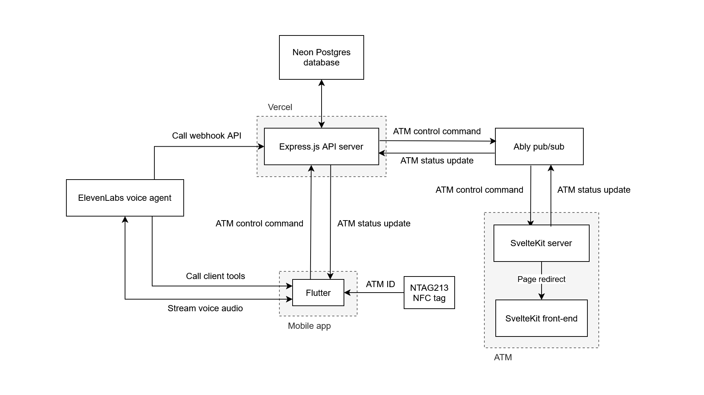
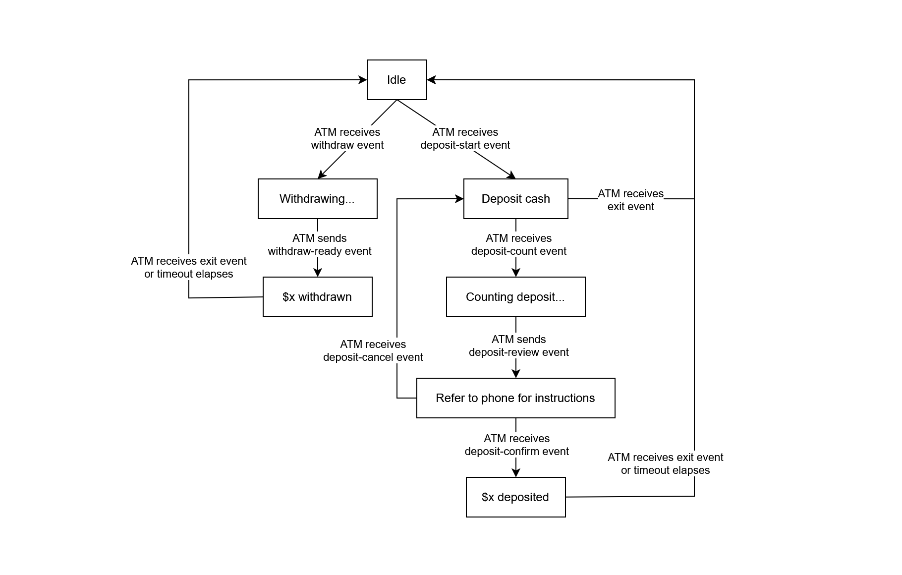

# System architecture: Bombastic Banking

This document explains the architecture of Bombastic Banking, an accessible digital banking prototype. The system comprises three main parts: a mobile app, an ATM server, and an API server.

The system's main feature is "touchless ATM transactions", which allows users to operate ATMs from their mobile phones. Each ATM has their own NTAG213 NFC tag containing the ATM's ID. We plan to move to NTAG424 DNA for proper security. Our other features are an agentic voice assistant and user-to-user transfers.

For this prototype, we have no cash-related hardware, so all cash transactions are simulated.

- [1. Touchless ATM overview](#1-touchless-atm-overview)
- [2. Definitions](#2-definitions)
- [3. Tech stack](#3-tech-stack)
- [4. System components](#4-system-components)
  - [4.1. Mobile app](#41-mobile-app)
  - [4.2. ATM server](#42-atm-server)
  - [4.3. API server](#43-api-server)
- [5. Realtime messaging](#5-realtime-messaging)
- [6. Double-entry accounting](#6-double-entry-accounting)
  - [6.1. Ledger sign convention](#61-ledger-sign-convention)

## 1. Touchless ATM overview

## 2. Definitions

- **Touchless ATM session:** The period during which an authenticated mobile app user is controlling a specific ATM.
- **Touchless ATM transaction:** An ATM deposit / withdrawal made from the mobile app.
- **ATM control command:** A message instructing the ATM to perform a certain action.
- **ATM status update:** A message notifying the API server / mobile app of an ATM's updated status.

## 3. Tech stack

- **Mobile app:** Flutter.
- **ATM server:** SvelteKit.
- **API server:** Express on Vercel.
- **Database:** Neon Postgres.
- **Realtime messaging:** Ably.
- **Voice agent:** ElevenLabs.

## 4. System components

### 4.1. Mobile app

The mobile app is the interface for user account management and touchless ATM transactions.

When it reads the ATM's NTAG213 tag, it uses the API server's HTTP API to start a touchless ATM session using the ATM's ID. During a touchless ATM session, the mobile app sends ATM control commands (e.g. "withdraw $50", "initiate deposit") through the API server's HTTP API.

### 4.2. ATM server

The ATM runs a web server hosting its own GUI. On start-up, it connects to the realtime system, authenticating with the `ATM_KEY` environment variable. The ATM GUI starts in its idle state, and it transitions according to commands from the realtime system (refer to [Realtime messaging](#realtime-messaging) below for details).

The web server runs on the ATM itself rather than being hosted online to ensure reliable, low-latency UI updates. While the prototype does not currently involve hardware, running the web server on-device also enables direct hardware interaction once implemented, eliminating the need for a local hardware control daemon and simplifying the overall architecture. This on-device setup additionally reduces exposure to the public internet, minimising security risks.

### 4.3. API server

The API server interfaces with the database and provides HTTP APIs to the mobile app for user account management and ATM command-sending.

The API server acts as an intermediary between the mobile app and the ATM server, relaying via the pub/sub system:

- ATM control commands from the mobile app to the ATM server.
- ATM status updates from the ATM server to the mobile app.

Refer to [Realtime messaging](#realtime-messaging) below for details.

## 5. Realtime messaging

The ATM server and API server perform realtime messaging through a pub/sub system, where each ATM uses a channel named `atm:{atmId}`. The table below documents the events sent through each channel.

| Event             | Originator | Payload           | Description                                                                                                                    |
| ----------------- | ---------- | ----------------- | ------------------------------------------------------------------------------------------------------------------------------ |
| `withdraw`        | API server | Withdraw amount   | Command the ATM to dispense the indicated cash amount.                                                                         |
| `withdraw-ready`  | ATM        |                   | Notify the API server that the ATM has successfully dispensed cash.                                                            |
| `deposit-start`   | API server |                   | Command the ATM to prepare to receive a cash deposit.                                                                          |
| `deposit-count`   | API server |                   | Command the ATM to receive and count deposited cash.                                                                           |
| `deposit-review`  | ATM        | Deposit breakdown | Notify the API server that the deposit has been counted, and instruct the user to review the counted per-denomination amounts. |
| `deposit-confirm` | API server |                   | Notify the API server that the ATM has successfully received the indicated cash amount.                                        |
| `exit`            | API server |                   | Command the ATM to return to its idle state, allowing other users to use it.                                                   |

## 6. Double-entry accounting

The database uses a double-entry accounting system to track all financial transactions, providing a complete audit trail of all money movements. This means that every transaction affects at least two accounts, and at any time it can be verified that all money is accounted for by checking that all ledger entries' `change` sum to zero. This ensures that money never appears or disappears; it only moves between accounts.

The system comprises three account types:

- Customer accounts (liabilities): Money the bank owes to customers.
- Cash vault (asset): Physical cash holdings.
- Shareholder equity (liability): Bank owners' initial investment.

### 6.1. Ledger sign convention

The ledger uses an asset/liability perspective, where the sign of each entry's `change` has different meanings:

| Account type                      | Change sign | Meaning                              |
| --------------------------------- | ----------- | ------------------------------------ |
| Asset (e.g. cash vault)           | Positive    | Asset increases (bank gains cash)    |
| Asset (e.g. cash vault)           | Negative    | Asset decreases (bank loses cash)    |
| Liability (e.g. customer account) | Positive    | Liability decreases (bank owes less) |
| Liability (e.g. customer account) | Negative    | Liability increases (bank owes more) |

**Example: customer deposits \$100**

When a customer deposits \$100, their balance increases, but this is recorded as a -\$100 change (liability increase). Their balance is computed as their `-sum(change)`, converting from the bank's liability perspective to the customer's perspective.

| Account          | Type      | Change | Meaning                 |
| ---------------- | --------- | ------ | ----------------------- |
| Customer account | Liability | -\$100 | Bank owes customer more |
| Cash Vault       | Asset     | +\$100 | Bank gains cash         |
